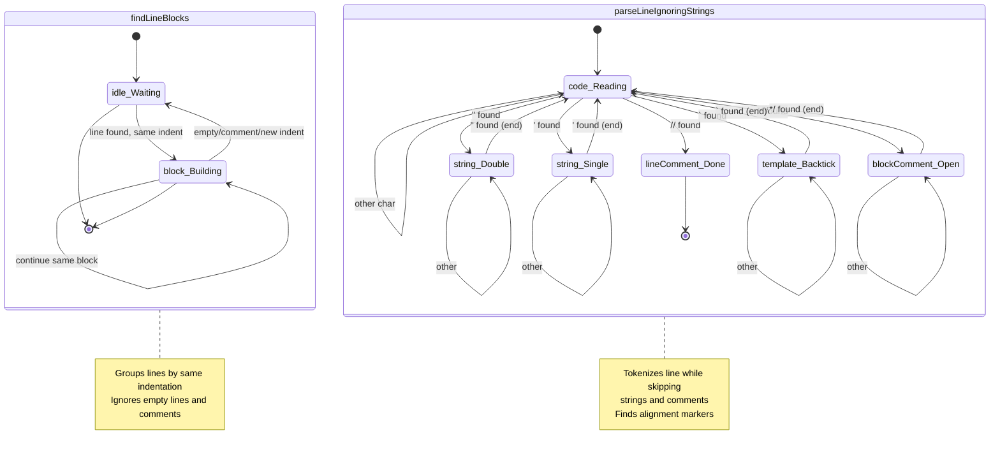
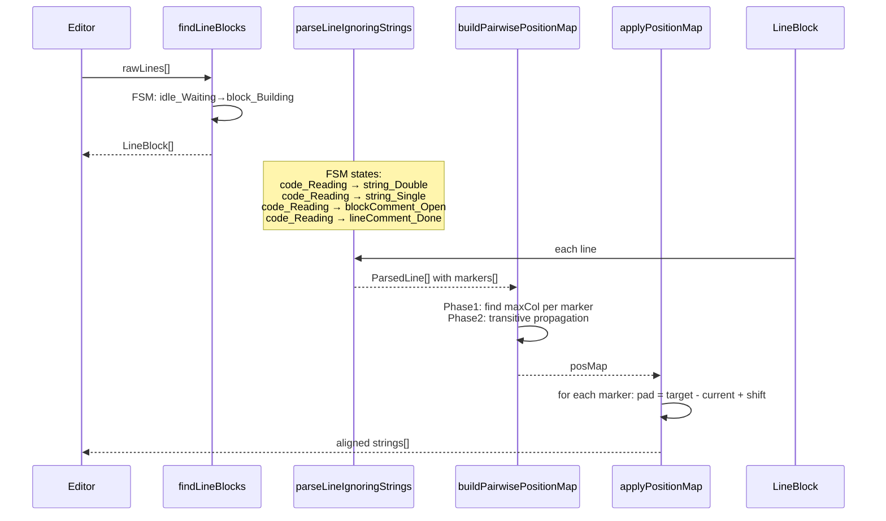

# FSM State Machines — src/extension.ts

```mermaid
stateDiagram-v2
    %% findLineBlocks FSM
    state findLineBlocks {
        [*] --> idle_Waiting
        idle_Waiting --> block_Building: line found, same indent
        block_Building --> idle_Waiting: empty/comment/new indent
        block_Building --> block_Building: continue same block
        idle_Waiting --> [*]
        block_Building --> [*]
    }

    %% parseLineIgnoringStrings FSM
    state parseLineIgnoringStrings {
        [*] --> code_Reading
        code_Reading --> blockComment_Open: /* found
        code_Reading --> lineComment_Done: // found
        code_Reading --> string_Double: " found
        code_Reading --> string_Single: ' found
        code_Reading --> template_Backtick: ` found
        code_Reading --> code_Reading: other char
        
        string_Double --> code_Reading: " found (end)
        string_Double --> string_Double: other
        string_Single --> code_Reading: ' found (end)
        string_Single --> string_Single: other
        template_Backtick --> code_Reading: ` found (end)
        template_Backtick --> template_Backtick: other
        
        blockComment_Open --> code_Reading: */ found (end)
        blockComment_Open --> blockComment_Open: other
        
        lineComment_Done --> [*]
    }

    %% Relationship between functions
    note right of findLineBlocks
        Groups lines by same indentation
        Ignores empty lines and comments
    end note

    note right of parseLineIgnoringStrings
        Tokenizes line while skipping
        strings and comments
        Finds alignment markers
    end note
```

## Function Data Flow

```mermaid
flowchart LR
    subgraph Input
        rawLines["raw lines from editor"]
    end

    subgraph findLineBlocks["findLineBlocks()"]
        fb_input["rawLines[]"]
        fb_output["LineBlock[]"]
    end

    subgraph parseLineIgnoringStrings["parseLineIgnoringStrings()"]
        parse_input["line string"]
        parse_output["ParsedLine with markers[]"]
    end

    subgraph buildPairwisePositionMap["buildPairwisePositionMap()"]
        ppm_input["ParsedLine[]"]
        ppm_output["position map"]
    end

    subgraph applyPositionMap["applyPositionMap()"]
        apm_input["ParsedLine[] + map"]
        apm_output["aligned strings[]"]
    end

    rawLines --> fb_input
    fb_input --> fb_output
    fb_output --> parse_input
    
    parse_input --> parse_output
    parse_output --> ppm_input
    
    ppm_input --> ppm_output
    ppm_output --> apm_input
    
    apm_input --> apm_output
```

## State Transitions Detail

```mermaid
sequenceDiagram
    participant Editor
    participant findLineBlocks
    participant parseLineIgnoringStrings
    participant buildPairwisePositionMap
    participant applyPositionMap

    Editor->>findLineBlocks: rawLines[]
    findLineBlocks->>findLineBlocks: FSM: idle_Waiting→block_Building
    findLineBlocks-->>Editor: LineBlock[]

    Note over parseLineIgnoringStrings: FSM states:<br/>code_Reading → string_Double<br/>code_Reading → string_Single<br/>code_Reading → blockComment_Open<br/>code_Reading → lineComment_Done
    
    LineBlock->>parseLineIgnoringStrings: each line
    parseLineIgnoringStrings-->>buildPairwisePositionMap: ParsedLine[] with markers[]

    buildPairwisePositionMap->>buildPairwisePositionMap: Phase1: find maxCol per marker<br/>Phase2: transitive propagation
    buildPairwisePositionMap-->>applyPositionMap: posMap

    applyPositionMap->>applyPositionMap: for each marker: pad = target - current + shift
    applyPositionMap-->>Editor: aligned strings[]
```