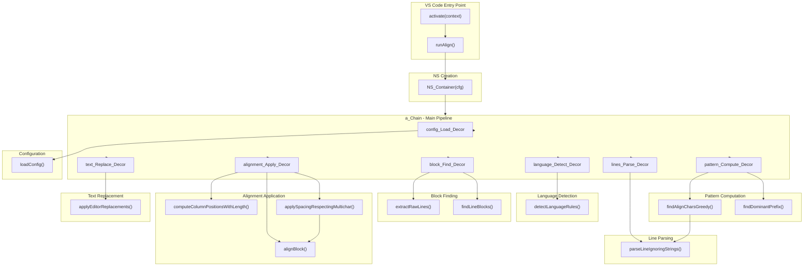

# Function Call Map — src/extension.ts



## Call Sequence

1. `activate` → registers VS Code commands
2. `runAlign` → creates NS via `NS_Container`
3. `a_Chain` executes 7 decorators sequentially:

| Step | Decorator | Pure Function |
|------|----------|--------------|
| 1 | `config_Load_Decor` | `loadConfig` |
| 2 | `language_Detect_Decor` | `detectLanguageRules` |
| 3 | `block_Find_Decor` | `extractRawLines`, `findLineBlocks` |
| 4 | `lines_Parse_Decor` | `parseLineIgnoringStrings` |
| 5 | `pattern_Compute_Decor` | `findDominantPrefix` |
| 6 | `alignment_Apply_Decor` | `alignBlock`, `computeColumnPositionsWithLength`, `applySpacingRespectingMultichar` |
| 7 | `text_Replace_Decor` | `applyEditorReplacements` |

## Data Flow

```
CONFIG (defaults)
    ↓
NS_Container → NS
    ↓
a_Chain → NS.data {
    editor,
    languageRules,
    blocks[],
    parsedLines[][],
    commonPrefix[][],
    alignedLines[][]
}
```