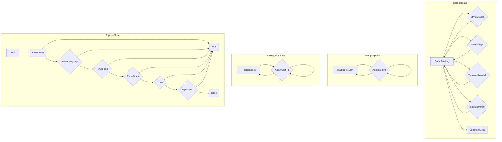

```mermaid
graph TD
    subgraph ScannerState
        A[CodeReading] --> B{StringDouble}
        A --> C{StringSingle}
        A --> D{TemplateBacktick}
        A --> E{BlockComment}
        A --> F(CommentDone)
        B --> A
        C --> A
        D --> A
        E --> A
    end

    subgraph GroupingState
        G[WaitingForStart] --> H{Accumulating}
        H --> G
        H --> H
    end

    subgraph PropagationState
        I[FindingSeries] --> J{Accumulating}
        J --> I
        J --> J
    end

    subgraph PipelineState
        K[Idle] --> L(LoadConfig)
        L --> M{DetectLanguage}
        L --> P(Error)
        M --> N{FindBlocks}
        M --> P
        N --> O{ParseLines}
        N --> P
        O --> Q{Align}
        O --> P
        Q --> R{ReplaceText}
        Q --> P
        R --> S(Done)
        R --> P
    end
```