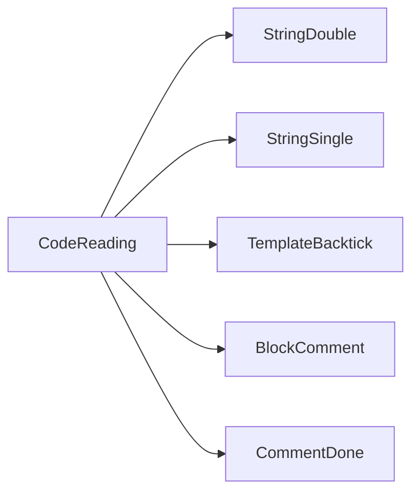
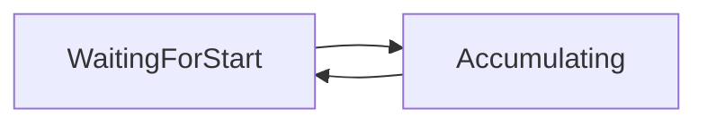
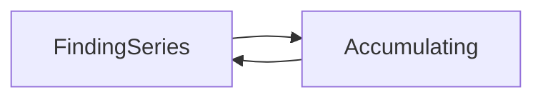
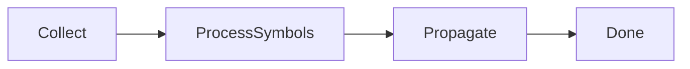
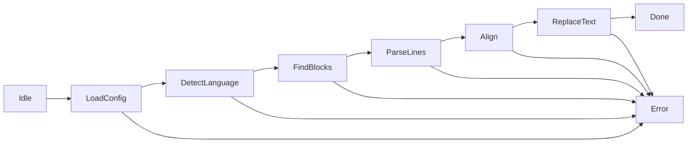
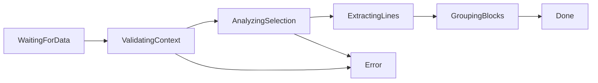

# FSM Documentation

## ScannerState (A2 - line_Parse)

## GroupingState (A3 - blocks_Find)

## PropagationState (A4 - positions_Propagate)

## PositionMapState (positionMap_Build)

## PipelineState (pipeline_Build)

## BlockSearchState (extension.ts - blockSearchFSM)
