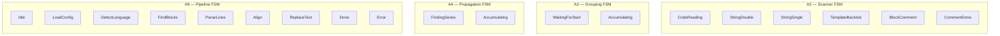

# FSM Hierarchy Diagram

```mermaid
flowchart TD
    subgraph Scanner["A2 — Scanner FSM"]
        direction TB
        SCR["`CodeReading`"]
        SD["`StringDouble`"]
        SS["`StringSingle`"]
        TBck["`TemplateBacktick`"]
        BC["`BlockComment`"]
        CD["`CommentDone`"]
    end

    subgraph Grouping["A3 — Grouping FSM"]
        direction TB
        WFS["`WaitingForStart`"]
        ACC["`Accumulating`"]
    end

    subgraph Propagation["A4 — Propagation FSM"]
        direction TB
        FS["`FindingSeries`"]
        ACP["`Accumulating`"]
    end

    subgraph Pipeline["A9 — Pipeline FSM"]
        direction TB
        IDL["`Idle`"]
        LC["`LoadConfig`"]
        DL["`DetectLanguage`"]
        FB["`FindBlocks`"]
        PL["`ParseLines`"]
        AL["`Align`"]
        RT["`ReplaceText`"]
        DN["`Done`"]
        ER["`Error`"]
    end
```