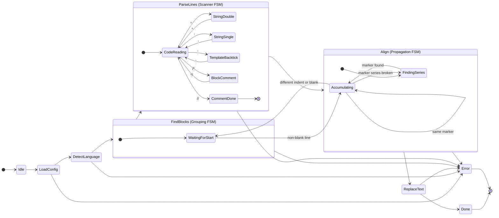

```mermaid
stateDiagram-v2
    direction LR
    
    [*] --> Idle
    Idle --> LoadConfig
    LoadConfig --> DetectLanguage
    DetectLanguage --> FindBlocks

    state "FindBlocks (Grouping FSM)" as FindBlocks {
        direction LR
        [*] --> WaitingForStart
        WaitingForStart --> Accumulating: non-blank line
        Accumulating --> WaitingForStart: different indent or blank
        Accumulating --> Accumulating: same indent
    }
    FindBlocks --> ParseLines

    state "ParseLines (Scanner FSM)" as ParseLines {
        direction LR
        [*] --> CodeReading
        CodeReading --> StringDouble: "
        CodeReading --> StringSingle: '
        CodeReading --> TemplateBacktick: `
        CodeReading --> BlockComment: /*
        CodeReading --> CommentDone: //

        StringDouble --> CodeReading: "
        StringSingle --> CodeReading: '
        TemplateBacktick --> CodeReading: `
        BlockComment --> CodeReading: */
        CommentDone --> [*]
    }
    ParseLines --> Align

    state "Align (Propagation FSM)" as Align {
      direction LR
      [*] --> FindingSeries
      FindingSeries --> Accumulating: marker found
      Accumulating --> FindingSeries: marker series broken
      Accumulating --> Accumulating: same marker
    }

    Align --> ReplaceText
    ReplaceText --> Done
    Done --> [*]

    LoadConfig --> Error
    DetectLanguage --> Error
    FindBlocks --> Error
    ParseLines --> Error
    Align --> Error
    ReplaceText --> Error
    Error --> [*]
```
